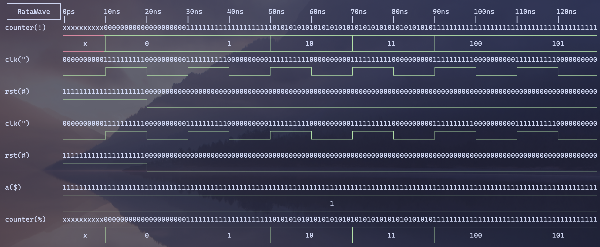

# RataWave

A terminal-based waveform previewer built with Rust and Ratatui.

## Implementation Goals

- [x] Display single-bit signals and multi-bit vectors
- [x] Zoom in/out and navigate along the time scale
- [ ] Jump to the next rising/falling edge
- [x] Jump to a specified time
- [ ] Select which signals to display
- [ ] Expand multi-bit vectors to single-bit signals for display
